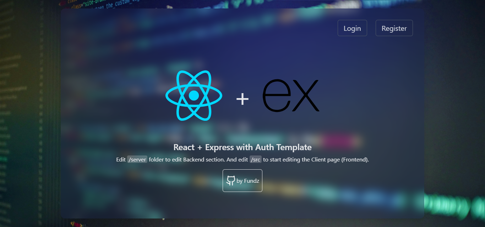

# MERN Template with Auth




Well you're Javascript ethusiast? You want to build a web application with a backend and a frontend only using javascript? This template may be for you!

I've been creating a template for a web application using Express, ReactJS and MongoDB. This template includes simple authentication system and dashboard with middleware protection. Here's are all the ✨ Features:

- 🔐 Register & Login using JWT
- 🧱 Protected Routes (Dashboard, Settings)
- ⚙️ Change Password, Logout, and Delete Account
- 🌗 Dark Mode Support
- 🎨 Responsive TailwindCSS UI
- 🔧 Structured backend (Controller, Middleware, Model)
- 🔥 Integrated directly between frontend and backend

## Folder Structure

```bash

📦project-root
├─ 📁server/
│  ├─ controllers/
│  ├─ middleware/
│  ├─ models/
│  ├─ routes/
│  ├─ server.js
│  └─ .env.example
├─ 📁src/
│  ├─ pages/
│  ├─ context/
│  ├─ layout/
│  └─ main.jsx
├─ 📁public/
├─ package.json
└─ README.md

```

## Installation Guide

### 1. Clone Repository

```bash
git clone https://github.com/byntangxyz/fullstack-js-with-auth.git
cd fullstacks-js-with-auth
```

### 2. Install Dependencies

Using npm:

```bash
npm install
```

Using pnpm:

```bash
pnpm install
```

### 3. Setup Environment Variables

```bash
cp server/.env.example server/.env

```

You can modify the `.env` file to suit your needs. Here are the default configuration:
```env
MONGO_URI=mongodb://localhost:27017/yourdb
JWT_SECRET=iloveyoursister
PORT=5000
```
> Make sure you've installed [MongoDB](https://www.mongodb.com/try/download/community) on your computer


### 4. Run the Application

```bash
npm run dev
```

Script Avaliable:

| Script     | Commands                                           |
| ---------- | -------------------------------------------------- |
| dev        | concurrently \"npm:dev-client\" \"npm:dev-server\" |
| dev-client | vite                                               |
| dev-server | nodemon server/server.js                           |
| build      | vite build                                         |
| preview    | vite preview                                       |
| lint       | eslint .                                           |

### 5. Start Editing the App

Edit `/server` folder to edit Backend section. And edit `/src` to start editing the Client page (Frontend).

## Contribution?

Feel free to contribute to this project by opening a pull request.
